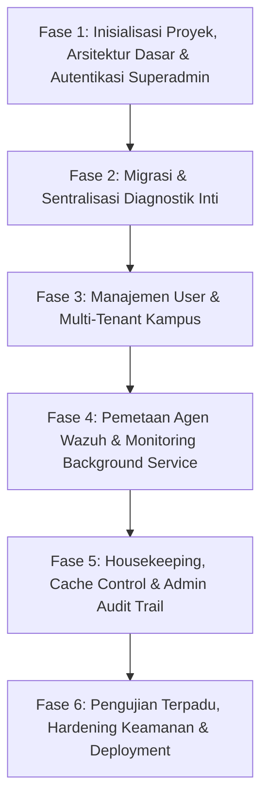

# Master Implementation Plan: ASOC Web Admin Portal (Phase-by-Phase)

Dokumen ini merupakan rancangan implementasi bertahap (*phase-by-phase*) yang mendetail untuk pembangunan **Web Admin (Superadmin Portal) ASOC** yang terpisah dari dashboard monitoring tenant.

Tech stack diselaraskan secara penuh dengan dashboard: **Next.js 15 (App Router) + React 19 + TypeScript + Tailwind CSS + Better-Auth + MySQL/Mongo/IORedis**.

---

## Arsitektur & Lingkungan Target

* **Server Backend ASOC VM**: `10.175.209.82`
* **MySQL Auth & Tenant DB**: Port `3306` (`auth_db`)
* **MongoDB Multi-Tenant SSOT**: Port `27017`
* **Redis L1 Real-time Cache**: Port `6379`
* **Wazuh REST API**: Port `55000` (`https://10.175.209.82:55000`)
* **Wazuh OpenSearch Indexer**: Port `9200`
* **DFIR-IRIS Management API**: Port `8443` / PostgreSQL `5432`
* **Go gRPC Multi-Tenant Pumper**: Port `50057`

---

## 📑 DAFTAR FASE PENGEMBANGAN



---

# 🚀 FASE 1: Inisialisasi Proyek, Arsitektur Dasar & Autentikasi Superadmin

### 1.1 Sasaran Fase
Membangun fondasi repositori aplikasi Web Admin mandiri, mengonfigurasi konektivitas multi-database pool berkinerja tinggi, mengimplementasikan sistem autentikasi role `superadmin` dengan Better-Auth, dan mendesain layout global admin yang modern dan responsif.

### 1.2 Struktur File & Komponen yang Dibuat

```
admin-portal/
├── app/
│   ├── (auth)/login/page.tsx               # Halaman Login Khusus Superadmin
│   ├── (admin)/layout.tsx                  # Shell Admin (Sidebar + Header + Breadcrumb)
│   ├── (admin)/page.tsx                    # Overview Dashboard Kesehatan Sistem
│   ├── api/auth/[...all]/route.ts          # Better-Auth Handler Endpoint
│   ├── api/auth/login/route.ts             # Superadmin Custom Authentication Handler
│   └── layout.tsx & globals.css            # Root Theme & Fonts
├── components/
│   ├── layout/Sidebar.tsx                  # Navigasi Admin dengan menu collapsible
│   ├── layout/AdminHeader.tsx              # Top bar (Live DB status badges, jam WIB, profil)
│   └── ui/StatusBadge.tsx, MetricCard.tsx  # Shared UI Components
├── lib/
│   ├── mysql.ts                            # Pool koneksi MySQL2 ke auth_db
│   ├── mongodb.ts                          # Pool koneksi MongoClient dengan auto-reconnect
│   ├── redis.ts                            # IORedis client pool
│   ├── wazuh.ts                            # Axios/Fetch client ke Wazuh API :55000
│   ├── iris.ts                             # Client ke DFIR-IRIS API :8443
│   └── auth.ts                             # Konfigurasi Better-Auth (Role Superadmin)
├── middleware.ts                           # Edge Middleware (Hanya role superadmin)
└── .env.local                              # Kredensial VM 10.175.209.82
```

### 1.3 Detail Teknis & Alur Logika

1. **Database Connectors (`lib/`)**:
   - `lib/mysql.ts`: Koneksi pool ke MySQL `10.175.209.82:3306` (`auth_db`), mendukung verifikasi password hash SHA-256, SHA-512, dan verifikasi role `superadmin`.
   - `lib/mongodb.ts`: Pool koneksi MongoDB dengan timeout cepat (fail-fast 300ms) dan auto-reconnect.
   - `lib/redis.ts`: IORedis instance terhubung ke `10.175.209.82:6379`.
2. **Edge Security Middleware (`middleware.ts`)**:
   - Membaca session cookie `better-auth.session_token` atau `auth_session`.
   - Memvalidasi bahwa user yang login memiliki role `superadmin`.
   - Jika belum login atau role hanya `tenant`, otomatis redirect ke `/login` dengan parameter `?error=unauthorized`.
3. **Admin Shell Layout (`app/(admin)/layout.tsx`)**:
   - Sidebar navigasi modular dengan menu: *Overview*, *Database Status*, *Data Sync*, *Benchmark*, *User Management*, *Tenant Management*, *Agent Mapping*, *Service Monitor*, *Housekeeping*, *Audit Logs*.
   - Header interaktif yang menampilkan live indicator status server ASOC.

### 1.4 Checklist Aksi Fase 1
- [ ] Inisialisasi proyek Next.js 15 TypeScript Tailwind CSS.
- [ ] Konfigurasi `.env.local` terhubung ke server ASOC `10.175.209.82`.
- [ ] Implementasi `lib/mysql.ts`, `lib/mongodb.ts`, `lib/redis.ts`, `lib/wazuh.ts`.
- [ ] Setup Better-Auth adapter dan konfigurasi role `superadmin` di `lib/auth.ts`.
- [ ] Pembuatan `middleware.ts` untuk proteksi rute admin.
- [ ] Pembuatan halaman Login (`/login`) dengan penanganan error kredensial.
- [ ] Pembuatan komponen layout: `Sidebar.tsx`, `AdminHeader.tsx`.
- [ ] Pembuatan halaman `Overview` (`/`) dengan ringkasan status sistem.

### 1.5 Kriteria Keberhasilan & Verifikasi
* Superadmin berhasil login dan diarahkan ke halaman admin.
* Akun non-superadmin (user tenant) ditolak masuk ke portal admin.
* Seluruh driver database (MySQL, Mongo, Redis, Wazuh) berhasil melakukan ping test ke `10.175.209.82`.

---

# ⚙️ FASE 2: Migrasi & Sentralisasi Diagnostik Inti (Pengganti Debug Modal)

### 2.1 Sasaran Fase
Memindahkan seluruh logika diagnostik yang sebelumnya berada di modal debug dashboard tenant ke dalam halaman-halaman terdedikasi di Web Admin, serta membersihkan dashboard tenant dari elemen debug.

### 2.2 Struktur File & Komponen yang Dibuat

```
admin-portal/
├── app/(admin)/
│   ├── database-status/page.tsx            # Live Health Check & Data Parity Audit
│   ├── data-sync/page.tsx                  # Pemicu Sinkronisasi & Rekonsiliasi Data
│   └── benchmark/page.tsx                  # Benchmark Latensi & Throughput Database
├── app/api/
│   ├── database/status/route.ts            # API Health check & Paritas data
│   ├── data-sync/route.ts                  # API Eksekusi sinkronisasi pipeline
│   └── benchmark/route.ts                  # API Benchmark read/write/pipeline
└── components/
    ├── database/LiveNodeCard.tsx           # Kartu status live tiap database engine
    ├── database/ParityTable.tsx            # Tabel rekonsiliasi OpenSearch vs Mongo vs Redis vs IRIS
    ├── sync/SyncTriggerForm.tsx            # Form pemicu sync per-tenant & rentang waktu
    └── benchmark/LatencyChart.tsx          # Visualisasi latensi ms & ops/detik
```

### 2.3 Detail Teknis & Alur Logika

1. **Live Database Health Check (`/database-status`)**:
   - Memeriksa koneksi simultan ke 6 komponen: MySQL (`auth_db`), MongoDB Master, Redis L1, OpenSearch Indexer (`:9200`), DFIR-IRIS PostgreSQL (`:5432`), dan Wazuh API (`:55000`).
   - Menghitung latensi *Round Trip Time (RTT)* dalam milidetik.
   - Melakukan audit paritas jumlah dokumen: membandingkan hitungan dokumen di OpenSearch, MongoDB (`.incident`, `.vulnerability`, `.reports`), dan key di Redis.
2. **Data Sync & Reconciliation (`/data-sync`)**:
   - Menerima parameter: `tenant` (UI / UPJ / ITB / all), `pipeline` (*all*, *wazuh-indexer-to-mongo*, *mongo-to-redis*, *iris-to-mongo*, *wazuh-agents*), `timeRange` (*1day*, *7days*, *30days*, *custom*), serta `startDate` & `endDate`.
   - Menjalankan sinkronisasi presisi dan mengembalikan hasil: durasi eksekusi (ms), total record diproses, dan detail status per pipeline.
3. **Database Performance Benchmark (`/benchmark`)**:
   - Menjalankan benchmark terisolasi:
     * Redis: 1000 Read/Write Ops (menguji performa sub-millisecond).
     * MongoDB: Insert & Find latency (ms).
     * MySQL: Query SELECT/JOIN latency (ms).
     * Pipeline throughput: Menghitung kecepatan pemompaan data (Docs/detik).
4. **Pembersihan Dashboard Tenant (`dashboard-1`)**:
   - Menghapus komponen `DatabaseStatusModal.tsx` dari proyek `dashboard-1`.
   - Menghapus tombol trigger modal dari `Header.tsx` di dashboard tenant.

### 2.4 Checklist Aksi Fase 2
- [ ] Pembuatan backend API `/api/database/status` dengan audit paritas data.
- [ ] Pembuatan halaman UI `/database-status` dengan kartu status live & tabel paritas.
- [ ] Pembuatan backend API `/api/data-sync` dengan dukungan filter tenant & tanggal.
- [ ] Pembuatan antarmuka form `/data-sync` dengan progress bar dan laporan hasil eksekusi.
- [ ] Pembuatan backend API `/api/benchmark` untuk pengukuran latensi & throughput.
- [ ] Pembuatan halaman UI `/benchmark` dengan tabel komparasi performa database.
- [ ] Refactoring `dashboard-1`: Hapus modal debug dan tombol terkait di Header tenant.

### 2.5 Kriteria Keberhasilan & Verifikasi
* Halaman `/database-status` menampilkan status hijau/merah dan latensi akurat seluruh database.
* Pemicu sync di `/data-sync` sukses memperbarui data di MongoDB dan Redis pada server `10.175.209.82`.
* Halaman `/benchmark` menampilkan data latensi real-time (Redis < 1ms, Mongo ~1-5ms).
* Dashboard tenant (`dashboard-1`) berjalan bersih tanpa modal debug.

---

# 👥 FASE 3: Manajemen User & Multi-Tenant Kampus

### 3.1 Sasaran Fase
Menyediakan antarmuka GUI penuh untuk mengelola pengguna (RBAC), penugasan kampus, reset password, serta otomatisasi pendaftaran tenant kampus baru (*automated database provisioning*).

### 3.2 Struktur File & Komponen yang Dibuat

```
admin-portal/
├── app/(admin)/
│   ├── users/page.tsx                      # Tabel User, Search, Filter & Aksi
│   └── tenants/page.tsx                    # Manajemen Tenant Kampus & Storage Quota
├── app/api/
│   ├── users/route.ts                      # GET (List Users) & POST (Create User)
│   ├── users/[id]/route.ts                 # PUT (Update User/Password) & DELETE
│   ├── tenants/route.ts                    # GET (List Tenants) & POST (Create Tenant)
│   └── tenants/[id]/route.ts               # PUT (Update Tenant) & DELETE
└── components/
    ├── users/UserModal.tsx                 # Modal Create / Edit User & Role
    ├── users/ResetPasswordModal.tsx        # Modal Reset Password
    └── tenants/TenantModal.tsx             # Modal Tambah Kampus Baru & Provisioning
```

### 3.3 Detail Teknis & Alur Logika

1. **Modul Manajemen User (`/users`)**:
   - Query data dari tabel MySQL `users` JOIN `tenants`.
   - **Create User**: Mendaftarkan user baru, melakukan hashing password (SHA-256 / Better-Auth standard), menetapkan role (`superadmin` / `tenant`), dan memetakan ke `tenant_id`.
   - **Reset Password**: Mengizinkan admin mereset password user secara instan.
   - **Delete User**: Menghapus user dan sesi aktifnya di tabel `session`.
2. **Modul Manajemen Tenant Kampus (`/tenants`)**:
   - Query data dari tabel MySQL `tenants` dan koleksi MongoDB `platform_master.tenants`.
   - **Automated Tenant Provisioning (Saat Kampus Baru Didaftarkan)**:
     * 1. Validasi keunikan `tenant_code` (misal: `ITB`, `UB`, `ITS`).
     * 2. Insert record ke tabel MySQL `auth_db.tenants` (`tenant_code`, `campus_name`, `database_name`, `redis_prefix`).
     * 3. Otomatis membuat database baru di MongoDB: `tenant_<kode_kampus>` atau `<nama_kampus>`.
     * 4. Membuat koleksi dasar dan indeks wajib di MongoDB:
       - `incident` -> Index: `(rule_id, agent_id, date)`
       - `vulnerability` -> Index: `(cve, agent, vulnerability)`
       - `devices` -> Index: `id`
       - `device_summary` -> Index: `tenant_code`
       - `reports` -> Index: `report_id`
     * 5. Mendaftarkan metadata ke `platform_master.tenants`.
   - **Storage Monitoring**: Menghitung kapasitas ukuran database di disk (MongoDB `db.stats().dataSize`) dan jumlah keys di Redis per-kampus.

### 3.4 Checklist Aksi Fase 3
- [ ] Pembuatan API `/api/users` (CRUD User & Password Hashing di MySQL).
- [ ] Pembuatan halaman UI `/users` dengan tabel, pagination, dan modal form.
- [ ] Pembuatan modal Reset Password dengan konfirmasi keamanan.
- [ ] Pembuatan API `/api/tenants` dengan workflow *Automated Provisioning*.
- [ ] Pembuatan script inisialisasi koleksi & indeks MongoDB untuk database tenant baru.
- [ ] Pembuatan halaman UI `/tenants` dengan daftar kampus, detail PIC, dan status toggle.
- [ ] Integrasi metrik ukuran database MongoDB dan jumlah key Redis per-tenant.

### 3.5 Kriteria Keberhasilan & Verifikasi
* Admin dapat membuat akun pengguna baru dan pengguna tersebut bisa langsung login di dashboard tenant miliknya.
* Saat admin mendaftarkan tenant kampus baru, database fisik baru di MongoDB langsung terbuat otomatis beserta seluruh indeksnya.
* Penghapusan/penonaktifan tenant langsung memblokir akses login analis kampus tersebut.

---

# 🌐 FASE 4: Pemetaan Agen Wazuh & Monitoring Background Service

### 4.1 Sasaran Fase
Menyediakan antarmuka untuk memetakan agen Wazuh yang terhubung ke database kampus target, mendeteksi agen yang belum dipetakan, serta memonitor status kesehatan background service / daemon pumper.

### 4.2 Struktur File & Komponen yang Dibuat

```
admin-portal/
├── app/(admin)/
│   ├── agent-mapping/page.tsx              # Pemetaan Wazuh Agent ke Tenant
│   └── service-monitor/page.tsx            # Monitoring Daemon & Background Workers
├── app/api/
│   ├── wazuh/agents/route.ts               # Fetch live agents dari Wazuh API :55000
│   ├── wazuh/mapping/route.ts              # Update pemetaan grup/agen ke tenant
│   └── services/status/route.ts            # Cek status systemd service & process daemon
└── components/
    ├── agents/AgentMappingTable.tsx        # Tabel pemetaan Agent ID -> Tenant Database
    ├── agents/UnassignedBanner.tsx         # Notifikasi agen yang belum terpetakan
    └── services/DaemonCard.tsx             # Kartu status daemon & log eksekusi terakhir
```

### 4.3 Detail Teknis & Alur Logika

1. **Pemetaan Agen Wazuh (`/agent-mapping`)**:
   - Memanggil endpoint Wazuh REST API `/agents` (`https://10.175.209.82:55000`).
   - Menampilkan tabel seluruh agen terdaftar: ID, Nama Host, IP, OS, Status (Active/Disconnected), dan Grup Wazuh.
   - **Pemetaan Interaktif**: Admin dapat memilih grup/agen dan mengaitkannya ke database tenant kampus target.
   - **Deteksi Unassigned Agent**: Menyorot agen yang belum masuk ke grup kampus terdaftar sehingga admin dapat segera menetapkan kepemilikannya.
2. **Monitoring Service & Background Daemon (`/service-monitor`)**:
   - Melakukan health-check terhadap servis latar belakang:
     * `fluent-bit` (Real-time log ingestion plugin)
     * `go_grpc_pumper` / `mongo-redis-multitenant-pumper` (Port `50057`)
     * `iris-case-shipper` (DFIR-IRIS continuous sync)
     * `asoc-agent-fetcher.timer` (Hourly agent fetcher cron)
     * `mongod.service` & `redis-server.service`
   - Membaca log eksekusi terakhir (timestamp, status keberhasilan, dan pesan error jika ada).

### 4.4 Checklist Aksi Fase 4
- [ ] Pembuatan API `/api/wazuh/agents` terhubung ke Wazuh REST API `:55000`.
- [ ] Pembuatan API `/api/wazuh/mapping` untuk menyimpan relasi agen/grup ke tenant.
- [ ] Pembuatan halaman UI `/agent-mapping` dengan dropdown tenant assignment.
- [ ] Pembuatan komponen deteksi *Unassigned Agents*.
- [ ] Pembuatan API `/api/services/status` untuk pengecekan status daemon background.
- [ ] Pembuatan halaman UI `/service-monitor` dengan indikator status live dan log riwayat.

### 4.5 Kriteria Keberhasilan & Verifikasi
* Seluruh agen di Wazuh Manager terdaftar dan dapat dipetakan ke kampus masing-masing.
* Status hidup/matinya daemon background terdeteksi akurat secara real-time.

---

# 🧹 FASE 5: Housekeeping, Cache Control & Admin Audit Trail

### 5.1 Sasaran Fase
Menyediakan alat pemeliharaan sistem (selective cache flush, pembersihan data historis lama MongoDB), serta pencatatan otomatis seluruh riwayat aktivitas administratif superadmin.

### 5.2 Struktur File & Komponen yang Dibuat

```
admin-portal/
├── app/(admin)/
│   ├── housekeeping/page.tsx               # Flush Cache Redis & Data Cleanup
│   └── audit-logs/page.tsx                 # Catatan Riwayat Aksi Admin
├── app/api/
│   ├── housekeeping/cache/route.ts         # API Flush Redis namespace per-tenant
│   ├── housekeeping/cleanup/route.ts       # API Cleanup data lama di MongoDB
│   └── audit-logs/route.ts                 # API Query log audit aktivitas admin
├── lib/
│   └── audit-logger.ts                     # Helper otomatis pencatatan log aksi
└── components/
    ├── housekeeping/FlushCacheModal.tsx    # Modal konfirmasi flush cache
    └── audit/AuditLogTable.tsx             # Tabel log viewer dengan filter & export
```

### 5.3 Detail Teknis & Alur Logika

1. **Housekeeping & Cache Control (`/housekeeping`)**:
   - **Selective Redis Flush**: Menghapus kunci Redis hanya pada prefix tenant tertentu (`<tenant_prefix>:*`) tanpa menghapus cache kampus lain.
   - **MongoDB Data Retention Cleanup**: Menghapus data insiden/kerentanan yang lebih lama dari batas waktu tertentu (misal: hapus data $\ge 180$ hari) pada database tenant tertentu untuk menghemat ruang disk.
2. **Admin Activity Audit Logger (`lib/audit-logger.ts` & `/audit-logs`)**:
   - Setiap aksi administratif otomatis dicatat ke tabel `admin_audit_logs`:
     * Timestamp & IP Address Admin.
     * ID & Nama Superadmin.
     * Tipe Aksi: `LOGIN`, `CREATE_USER`, `DELETE_USER`, `RESET_PASSWORD`, `CREATE_TENANT`, `MANUAL_SYNC`, `FLUSH_CACHE`, `CLEANUP_DATA`.
     * Target Resource & Deskripsi Detail.
   - Halaman `/audit-logs` menyediakan pencarian, filter berdasarkan rentang tanggal atau tipe aksi, serta pagination.

### 5.4 Checklist Aksi Fase 5
- [ ] Pembuatan API `/api/housekeeping/cache` untuk selective Redis flush by pattern.
- [ ] Pembuatan API `/api/housekeeping/cleanup` untuk penghapusan dokumen lama MongoDB.
- [ ] Pembuatan antarmuka UI `/housekeeping` dengan kartu kontrol dan dialog konfirmasi aman.
- [ ] Pembuatan tabel MySQL / MongoDB untuk `admin_audit_logs`.
- [ ] Pembuatan modul `lib/audit-logger.ts` dan integrasi ke seluruh API aksi admin.
- [ ] Pembuatan halaman UI `/audit-logs` dengan filter pencarian dan visualisasi log.

### 5.5 Kriteria Keberhasilan & Verifikasi
* Flush cache Redis untuk tenant UI berhasil menghapus key `universitas_indonesia:*` tanpa menyentuh key `universitas_pembangunan_jaya:*`.
* Seluruh tindakan admin (login, buat user, pemicu sync, flush) tercatat otomatis di audit logs.

---

# 🛡️ FASE 6: Pengujian Terpadu, Hardening Keamanan & Deployment

### 6.1 Sasaran Fase
Melakukan pengujian end-to-end menyeluruh, pengerasan keamanan (*security hardening*), dan penerapan konfigurasi deployment production terisolasi.

### 6.2 Detail Teknis & Alur Logika

1. **End-to-End Integration Testing**:
   - Pengujian alur lengkap: Pendaftaran Tenant Baru ➔ Pembuatan User ➔ Pemetaan Agen Wazuh ➔ Pemicu Sinkronisasi Data ➔ Verifikasi Tampilan di Dashboard Tenant.
   - Pengujian beban (*load test*) pada operasi benchmark dan sinkronisasi data.
2. **Security Hardening**:
   - Penerapan Rate Limiting pada endpoint autentikasi (`/api/auth/login`) dan pemicu sync.
   - Pengamanan HTTP Headers (*Content Security Policy*, *X-Frame-Options: DENY*, *X-Content-Type-Options: nosniff*).
   - Validasi ketat schema input form (*Zod validation*).
3. **Deployment Setup**:
   - Build aplikasi Next.js: `npm run build`.
   - Setup Process Manager (PM2 / Systemd Service) pada port terdedikasi (misal: port `3001` atau `8085`).
   - Setup Nginx Reverse Proxy dengan proteksi SSL / akses restricted IP (hanya IP manajemen internal SOC yang diizinkan mengakses portal admin).

### 6.3 Checklist Aksi Fase 6
- [ ] Menjalankan pengujian fungsional terintegrasi di semua modul.
- [ ] Penerapan rate-limiting dan sanitasi request.
- [ ] Pengujian session expiry dan proteksi brute-force login.
- [ ] Build production Next.js (`npm run build`).
- [ ] Konfigurasi service PM2 / Systemd untuk auto-restart saat server reboot.
- [ ] Konfigurasi Nginx VirtualHost untuk Web Admin.
- [ ] Dokumentasi panduan operasional Superadmin (*Administrator User Guide*).

### 6.4 Kriteria Keberhasilan & Verifikasi
* Aplikasi Web Admin berjalan stabil di mode production tanpa error.
* Portal admin hanya dapat diakses oleh user berwenang dengan latensi rendah.
* Dashboard tenant dan Web Admin beroperasi secara harmonis pada infrastruktur database ASOC.
