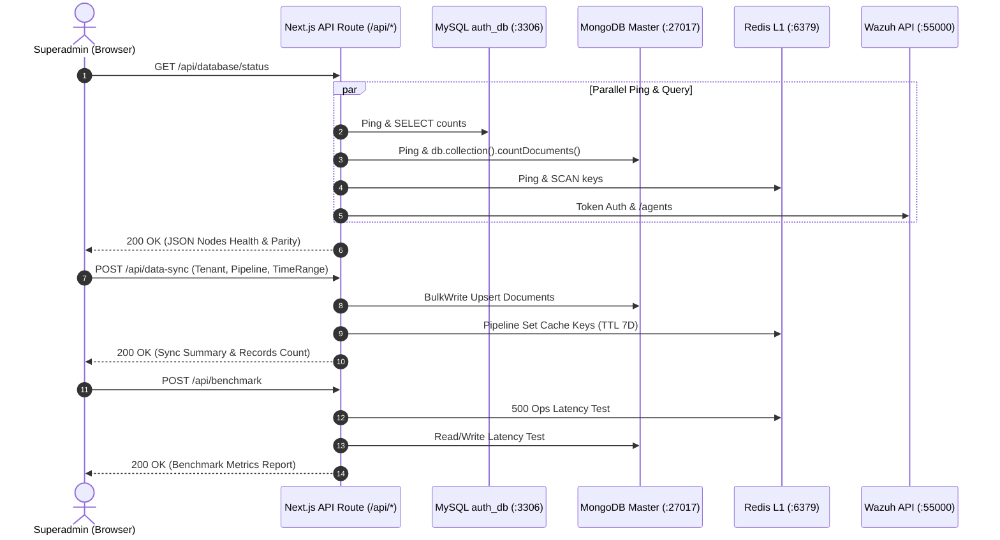

# Perencanaan Teknis Mendalam: FASE 2 — Migrasi & Sentralisasi Diagnostik Inti

Dokumen ini berisi spesifikasi teknis lengkap dan langkah implementasi untuk **Fase 2: Migrasi & Sentralisasi Diagnostik Inti (Pengganti Debug Modal)** pada portal Web Admin ASOC.

---

## 1. Ikhtisar & Tujuan Fase 2

Fase 2 berfokus pada **pemindahan seluruh kapabilitas diagnostik, pemantauan status database multi-engine, rekonsiliasi paritas data, pemicu sinkronisasi manual, dan pengujian benchmark performa** dari modal popup di dashboard tenant (`dashboard-1`) ke halaman-halaman terdedikasi di Web Admin (`admin-dashboard-panel-1`).

```
┌────────────────────────────────────────────────────────────────────────────────────────┐
│                                 TRANSISI ARSITEKTUR FASE 2                             │
├──────────────────────────────────────────┬─────────────────────────────────────────────┤
│ ❌ DESAIN LAMA (Dashboard Tenant)        │ ✅ DESAIN BARU (Web Admin Terdedikasi)      │
├──────────────────────────────────────────┼─────────────────────────────────────────────┤
│ • Debug modal di dalam dashboard tenant  │ • Halaman khusus /database-status           │
│ • Analis kampus bisa memicu benchmark    │ • Halaman khusus /data-sync                 │
│ • UI sempit di dalam modal pop-up        │ • Halaman khusus /benchmark                 │
│ • Akses tidak terisolasi ke superadmin   │ • Akses eksklusif Role: Superadmin          │
│                                          │ • Dashboard tenant murni Monitoring-Only    │
└──────────────────────────────────────────┴─────────────────────────────────────────────┘
```

---

## 2. Struktur Modul, Halaman & Komponen yang Dibangun

```
admin-dashboard-panel-1/
├── app/(admin)/
│   ├── database-status/page.tsx            # Halaman 1: Live Status & Paritas Data
│   ├── data-sync/page.tsx                  # Halaman 2: Pemicu Sinkronisasi Manual
│   └── benchmark/page.tsx                  # Halaman 3: Pengujian Benchmark Performa
├── app/api/
│   ├── database/status/route.ts            # API Health Check & Data Parity
│   ├── data-sync/route.ts                  # API Eksekusi Sinkronisasi Pipeline
│   └── benchmark/route.ts                  # API Benchmark Latensi & Throughput
└── components/
    ├── database/
    │   ├── LiveNodeCard.tsx                # Kartu status live tiap database engine
    │   ├── ParityTable.tsx                 # Tabel rekonsiliasi OpenSearch vs Mongo vs Redis vs IRIS
    │   └── TenantStatsGrid.tsx             # Rincian dokumen per-database kampus
    ├── sync/
    │   ├── SyncTriggerForm.tsx             # Form kontrol parameter sinkronisasi
    │   ├── SyncResultBanner.tsx            # Banner ringkasan durasi & record tersinkron
    │   └── SyncPipelineCard.tsx            # Kartu progres status per pipeline
    └── benchmark/
        ├── LatencyTable.tsx                # Tabel metrik latensi Read/Write & Throughput
        ├── PipelineBenchmarkCard.tsx       # Kecepatan pemompaan data (Docs/sec)
        └── LatencyVisualBar.tsx            # Bar komparasi visual sub-ms Redis vs DB lain
```

---

## 3. Spesifikasi Fungsional 3 Modul Utama

### 📌 Modul 1: Live Database Status & Parity Audit (`/database-status`)

Memberikan visibilitas status kesehatan, waktu latensi respon (*RTT ping*), serta keutuhan data (*data parity*) di seluruh basis data backend ASOC VM (`10.175.209.82`).

#### A. Node yang Dimonitor Secara Live:
| Database Engine | Port / Protocol | Target Metrik yang Dimonitor |
| :--- | :--- | :--- |
| **MySQL (`auth_db`)** | `3306` (TCP Pool) | Status Online, Ping Latency (ms), Total Tenants, Total User Accounts |
| **MongoDB Master** | `27017` (Direct) | Status Online, Ping Latency (ms), Total Dokumen (`incident`, `vulnerability`, `devices`, `reports`) per tenant |
| **Redis L1 Cache** | `6379` (IORedis) | Status Online, Sub-ms Latency (ms), Total Keys, Key distribution per namespace tenant |
| **Wazuh Indexer** | `9200` (HTTPS) | Status Cluster, Response Latency (ms) |
| **Wazuh REST API** | `55000` (HTTPS JWT) | Auth Token Status, Versi Wazuh (`v4.14.6`), Total Agen & Agen Aktif |
| **DFIR-IRIS** | `8443` / `5432` | Status REST API, Response Latency (ms), Total Kasus Forensik |

#### B. Skema Matriks Paritas Data (Data Parity Reconciliation):
1. **Wazuh OpenSearch Indexer ⟷ MongoDB Master**:
   * Memastikan seluruh alert dengan level $\ge 7$ dari Indexer telah tersimpan di koleksi `incident` MongoDB.
2. **MongoDB Master (7D Hot) ⟷ Redis L1 Cache**:
   * Memastikan data aktif rentang 7 hari di MongoDB telah dipompa ke Redis namespace `<tenant>:*`.
3. **DFIR-IRIS ⟷ MongoDB Reports**:
   * Memvalidasi sinkronisasi kasus forensik ke koleksi `reports` di masing-masing database kampus.
4. **Wazuh API ⟷ Device Registry**:
   * Memvalidasi endpoint agen aktif pada Wazuh Manager tercatat di koleksi `devices`.

---

### 📌 Modul 2: Data Synchronization & Reconciliation Manager (`/data-sync`)

Menyediakan antarmuka kontrol terpusat bagi Superadmin untuk memicu proses sinkronisasi dan perbaikan data (*data repair / backfill*) antar-layer.

#### A. Parameter Kontrol Sinkronisasi:
* **Target Tenant**:
  * `All Tenants` (Seluruh kampus terdaftar)
  * `Universitas Indonesia` (`UI` / `universitas_indonesia`)
  * `Universitas Pembangunan Jaya` (`UPJ` / `universitas_pembangunan_jaya`)
  * `Institut Teknologi Bandung` (`ITB` / `institut_teknologi_bandung`)
* **Target Pipeline**:
  * `All Pipelines` (Seluruh alur data)
  * `Wazuh Indexer ➔ MongoDB Incidents`
  * `MongoDB ➔ Redis L1 Cache`
  * `DFIR-IRIS ➔ MongoDB Reports`
  * `Wazuh API ➔ MongoDB Devices`
* **Jendela Waktu (*Time Range*)**:
  * `Today` (24 Jam Terakhir)
  * `Last 7 Days` (Default Operasional)
  * `Last 30 Days` (Historic Month)
  * `Custom Date Range` (`startDate` dan `endDate` spesifik)

#### B. Logika Eksekusi & Idempotency:
* Menggunakan operasi **BulkWrite Upsert** pada MongoDB dan **Pipeline Execution** pada Redis untuk memastikan tidak ada duplikasi data (*zero duplicate keys/records*).
* Menyajikan laporan hasil: Waktu eksekusi ($ms$), total record diproses, dan rincian status per tenant.

---

### 📌 Modul 3: Database & Pipeline Performance Benchmark (`/benchmark`)

Menguji dan memvalidasi performa latensi dan throughput nyata dari infrastruktur backend.

#### A. Rincian Pengujian:
1. **Uji Latensi Read / Write (ms)**:
   * **Redis**: Uji 500 operasi get/set in-memory (Validasi performa sub-millisecond $< 1.0\text{ ms}$).
   * **MongoDB**: Uji operasi insert dokumen sampel, query find by index, dan auto-cleanup.
   * **MySQL**: Uji query SELECT JOIN relasional `users` dan `tenants`.
   * **Wazuh Indexer & IRIS**: Uji latensi API call REST endpoint.
2. **Uji Throughput Pipeline (Docs/sec & Ops/sec)**:
   * Mengukur kecepatan pemompaan data dari MongoDB ke Redis L1 ($ops/sec$).
   * Mengukur kecepatan transformasi alert ke format insiden ASOC ($docs/sec$).

---

### 📌 Modul 4: Pembersihan Dashboard Tenant Eksisting (`dashboard-1`)

Langkah refactoring pada proyek `dashboard-1`:
1. Menghapus file modal `components/modals/DatabaseStatusModal.tsx`.
2. Menghapus state `isDbModalOpen` dan icon tombol server database pada `components/layout/Header.tsx`.
3. Memastikan dashboard tenant berjalan murni sebagai antarmuka monitoring data kampus.

---

## 4. Spesifikasi Kontrak REST API Endpoint



### A. Endpoint: `GET /api/database/status`
* **Response Payload Format**:
```json
{
  "success": true,
  "timestamp": "2026-08-28T15:35:00.000Z",
  "overallStatus": "HEALTHY",
  "executionDurationMs": 42,
  "nodes": {
    "mysql": {
      "name": "MySQL Multi-Tenant & Auth Store",
      "host": "10.175.209.82:3306",
      "database": "auth_db",
      "status": "ONLINE",
      "latencyMs": 1.2,
      "tenantsCount": 3,
      "usersCount": 6
    },
    "mongodb": {
      "name": "MongoDB Multi-Tenant Master SSOT",
      "host": "10.175.209.82:27017",
      "status": "ONLINE",
      "latencyMs": 2.4,
      "totalDocuments": 2548,
      "perTenantStats": {
        "universitas_indonesia": { "incident": 70, "vulnerability": 2460, "devices": 1, "reports": 5 },
        "universitas_pembangunan_jaya": { "incident": 16, "vulnerability": 0, "devices": 1, "reports": 3 },
        "institut_teknologi_bandung": { "incident": 0, "vulnerability": 0, "devices": 1, "reports": 1 }
      }
    },
    "redis": {
      "name": "Redis In-Memory L1 Hot Cache",
      "host": "10.175.209.82:6379",
      "status": "ONLINE",
      "latencyMs": 0.35,
      "totalKeys": 4731,
      "subMillisecond": true
    },
    "wazuhApi": {
      "name": "Wazuh REST API & Manager",
      "host": "https://10.175.209.82:55000",
      "status": "ONLINE",
      "latencyMs": 14.5,
      "version": "v4.14.6",
      "totalAgents": 2,
      "activeAgents": 2
    },
    "opensearch": {
      "name": "Wazuh OpenSearch Indexer",
      "host": "https://10.175.209.82:9200",
      "status": "ONLINE",
      "latencyMs": 11.8
    },
    "dfirIris": {
      "name": "DFIR-IRIS Investigation Store",
      "host": "https://10.175.209.82:8443 (DB: 5432)",
      "status": "ONLINE",
      "latencyMs": 8.1,
      "totalCases": 9
    }
  },
  "reconciliation": {
    "wazuhVsMongo": { "pipeline": "Wazuh Indexer ⟷ MongoDB", "totalA": 87, "totalB": 87, "isSynced": true, "statusText": "100% SYNCED" },
    "mongoVsRedis": { "pipeline": "MongoDB ⟷ Redis L1", "totalA": 2548, "totalB": 4731, "isSynced": true, "statusText": "100% SYNCED" },
    "irisVsMongo": { "pipeline": "DFIR-IRIS ⟷ MongoDB Reports", "totalA": 9, "totalB": 9, "isSynced": true, "statusText": "100% SYNCED" },
    "wazuhAgentsVsRegistry": { "pipeline": "Wazuh API ⟷ Device Registry", "totalA": 2, "totalB": 2, "isSynced": true, "statusText": "100% SYNCED" }
  }
}
```

### B. Endpoint: `POST /api/data-sync`
* **Request Payload Format**:
```json
{
  "tenant": "all",
  "pipeline": "all",
  "timeRange": "7days",
  "startDate": null,
  "endDate": null
}
```
* **Response Payload Format**:
```json
{
  "success": true,
  "action": "sync",
  "message": "Sinkronisasi selesai dengan sukses (Last 7 Days). Total 2548 record diperbarui.",
  "totalSynced": 2548,
  "durationMs": 340,
  "details": [
    { "tenant": "universitas_indonesia", "pipeline": "Incidents & Vulns Pipeline", "count": 2460, "status": "100% Synced" },
    { "tenant": "universitas_pembangunan_jaya", "pipeline": "Incidents & Devices Pipeline", "count": 20, "status": "100% Synced" },
    { "tenant": "institut_teknologi_bandung", "pipeline": "Reports & Devices Pipeline", "count": 4, "status": "100% Synced" }
  ]
}
```

### C. Endpoint: `POST /api/benchmark`
* **Request Payload Format**:
```json
{
  "action": "run_benchmark"
}
```
* **Response Payload Format**:
```json
{
  "success": true,
  "timestamp": "2026-08-28T15:35:00.000Z",
  "databaseLatencyBenchmark": [
    { "database": "Redis Real-Time Cache", "host": "10.175.209.82:6379", "readLatencyMs": 0.23, "writeLatencyMs": 0.45, "throughputOpsSec": 4350, "status": "Fast (Sub-ms)" },
    { "database": "MongoDB Historic Master", "host": "10.175.209.82:27017", "readLatencyMs": 1.45, "writeLatencyMs": 4.10, "throughputOpsSec": 680, "status": "Normal" },
    { "database": "MySQL Multi-Tenant Store", "host": "10.175.209.82:3306", "readLatencyMs": 0.85, "writeLatencyMs": 2.15, "throughputOpsSec": 2100, "status": "Fast" },
    { "database": "Wazuh OpenSearch Indexer", "host": "10.175.209.82:9200", "readLatencyMs": 12.40, "writeLatencyMs": 45.20, "throughputOpsSec": 1200, "status": "Normal" },
    { "database": "DFIR-IRIS PostgreSQL", "host": "10.175.209.82:5432", "readLatencyMs": 2.80, "writeLatencyMs": 18.50, "throughputOpsSec": 980, "status": "Normal" }
  ],
  "syncPipelineBenchmark": [
    { "pipeline": "Wazuh Indexer ➔ MongoDB", "throughputDocsSec": 1420, "statusText": "100% SYNCED" },
    { "pipeline": "MongoDB ➔ Redis Cache", "throughputDocsSec": 4650, "statusText": "100% SYNCED" },
    { "pipeline": "DFIR-IRIS ➔ MongoDB Reports", "throughputDocsSec": 85, "statusText": "100% SYNCED" }
  ]
}
```

---

## 5. Rencana Langkah Kerja / Action Checklist Fase 2

- [ ] **Langkah 1**: Membuat API Backend `/api/database/status/route.ts` dengan pengecekan kesehatan live & paritas data multi-tenant.
- [ ] **Langkah 2**: Membuat komponen UI `components/database/LiveNodeCard.tsx`, `ParityTable.tsx`, dan halaman `/database-status/page.tsx`.
- [ ] **Langkah 3**: Membuat API Backend `/api/data-sync/route.ts` dengan mesin pemroses pipeline data berparameter dinamis.
- [ ] **Langkah 4**: Membuat komponen UI `components/sync/SyncTriggerForm.tsx`, `SyncResultBanner.tsx`, dan halaman `/data-sync/page.tsx`.
- [ ] **Langkah 5**: Membuat API Backend `/api/benchmark/route.ts` untuk pengujian latensi Read/Write & throughput.
- [ ] **Langkah 6**: Membuat komponen UI `components/benchmark/LatencyTable.tsx`, `PipelineBenchmarkCard.tsx`, dan halaman `/benchmark/page.tsx`.
- [ ] **Langkah 7**: Refactoring pada `dashboard-1` (menghapus `DatabaseStatusModal.tsx` dan tombol server di `Header.tsx`).
- [ ] **Langkah 8**: Build verifikasi `npm run build` dan pengujian integrasi live ke VM `10.175.209.82`.

---

## 6. Kriteria Uji Terima & Verifikasi Keberhasilan (*Acceptance Criteria*)

1. **Live Health Check**: Halaman `/database-status` menampilkan status `ONLINE` untuk semua 6 node basis data beserta waktu latensi nyata ($ms$).
2. **Audit Paritas**: Jumlah dokumen yang dilaporkan di tabel rekonsiliasi paritas akurat sesuai data nyata di MongoDB & Redis VM.
3. **Pemicu Sinkronisasi**: Form `/data-sync` sukses mengeksekusi sinkronisasi dan data baru langsung tersimpan di MongoDB/Redis.
4. **Validasi Benchmark**: Halaman `/benchmark` membuktikan kecepatan akses Redis pada level *sub-millisecond* ($< 1\text{ ms}$).
5. **Dashboard Tenant Steril**: Proyek `dashboard-1` berjalan bersih tanpa modal debug.
