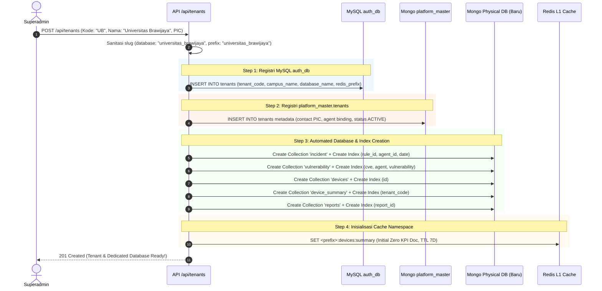

# Perencanaan Teknis Mendalam: FASE 3 — Manajemen User & Multi-Tenant Kampus

Dokumen ini berisi spesifikasi teknis lengkap, alur logika, dan rancangan implementasi untuk **Fase 3: Manajemen User & Multi-Tenant Kampus** pada portal Web Admin ASOC.

---

## 1. Ikhtisar & Tujuan Fase 3

Sebelumnya, pendaftaran tenant kampus dan pembuatan akun pengguna dilakukan secara manual menggunakan script Python di terminal server (`tenant_manager.py` / `user_auth_manager.py`). 

**Tujuan Utama Fase 3** adalah menghadirkan antarmuka grafis (GUI) terpusat untuk:
1. **Manajemen User & RBAC**: Mengelola akun pengguna (Superadmin, Tenant Admin, Analis Kampus), hak akses, dan fasilitas reset password instan.
2. **Manajemen Tenant Kampus & Automated Provisioning**: Mengelola profil kampus serta melakukan *otomatisasi provisioning database* (pembuatan database fisik MongoDB baru, inisialisasi koleksi & indeks, pendaftaran prefix Redis, dan registrasi di MySQL `auth_db`).
3. **Storage & Capacity Monitoring**: Memantau kapasitas ukuran disk database MongoDB dan memori Redis yang digunakan oleh masing-masing kampus.

---

## 2. Struktur Modul, Halaman & Komponen yang Dibangun

```
admin-dashboard-panel-1/
├── app/(admin)/
│   ├── users/page.tsx                      # Halaman 1: Manajemen User & Hak Akses
│   └── tenants/page.tsx                    # Halaman 2: Manajemen Tenant Kampus & Storage
├── app/api/
│   ├── users/route.ts                      # API: GET (List Users) & POST (Create User)
│   ├── users/[id]/route.ts                 # API: PUT (Update User/Password) & DELETE
│   ├── tenants/route.ts                    # API: GET (List Tenants) & POST (Create Tenant + Provisioning)
│   └── tenants/[id]/route.ts               # API: PUT (Update Tenant/Status) & DELETE
└── components/
    ├── users/
    │   ├── UserTable.tsx                   # Tabel interaktif user (Search, Role badge, Status)
    │   ├── UserModal.tsx                   # Modal form tambah/edit pengguna
    │   └── ResetPasswordModal.tsx          # Modal reset password dengan enkripsi aman
    └── tenants/
        ├── TenantTable.tsx                 # Tabel daftar kampus, PIC, status, & storage
        ├── TenantProvisioningModal.tsx     # Modal pendaftaran kampus baru + automated setup
        ├── TenantStatusToggle.tsx          # Switch active / suspended status
        └── StorageUsageBar.tsx             # Visual progress bar kapasitas disk Mongo per-kampus
```

---

## 3. Spesifikasi Fungsional 2 Modul Utama

```
                                  ┌─────────────────────────────────────────────────────────┐
                                  │            WEB ADMIN: FASE 3 USER & MULTI-TENANT        │
                                  └────────────────────────────┬────────────────────────────┘
                                                               │
                                ┌──────────────────────────────┴──────────────────────────────┐
                                │                                                             │
                                ▼                                                             ▼
                ┌───────────────────────────────┐                             ┌───────────────────────────────┐
                │   1. MANAJEMEN USER & RBAC    │                             │ 2. MANAJEMEN TENANT KAMPUS    │
                │          (/users)             │                             │    & AUTOMATED PROVISIONING   │
                ├───────────────────────────────┤                             │          (/tenants)           │
                │ • Tabel Pengguna Multi-Tenant │                             ├───────────────────────────────┤
                │ • Role: Superadmin vs Tenant  │                             │ • Registri Kampus (UI/UPJ/ITB)│
                │ • Password Hashing (SHA-256)  │                             │ • Automated MongoDB Creation  │
                │ • Better-Auth Synchronization │                             │ • Auto Index Initialization   │
                │ • Reset Password & Force Out  │                             │ • Redis Prefix Allocation     │
                │ • Search & Filter per Kampus  │                             │ • Storage & Quota Monitoring  │
                └───────────────────────────────┘                             └───────────────────────────────┘
```

---

### 📌 Modul 3.1: Manajemen User & RBAC (`/users`)

Mengelola seluruh identitas pengguna di ekosistem ASOC yang tersimpan pada tabel MySQL `auth_db.users` dan disinkronisasikan ke tabel Better-Auth `user` & `account`.

#### A. Struktur Role & Hak Akses (RBAC Matrix):
| Role | Akses Web Admin (`:3001`) | Akses Dashboard Tenant (`:3000`) | Ruang Lingkup Data |
| :--- | :---: | :---: | :--- |
| **`superadmin`** | ✅ Penuh | ✅ Opsional / Global | Seluruh data kampus, diagnostik, sinkronisasi, dan konfigurasi. |
| **`tenant_admin`** / **`admin`** | ❌ Ditolak | ✅ Penuh (di kampusnya) | Terkunci hanya pada database & Redis prefix kampus miliknya. |
| **`tenant`** / **`analyst`** | ❌ Ditolak | ✅ Read & Investigasi | Terkunci hanya pada database & Redis prefix kampus miliknya. |

#### B. Fitur Manajemen Pengguna:
1. **Daftar Pengguna (*User List Grid*)**:
   * Menampilkan: Username, Nama Kampus/Tenant, Email, Role Badge, Tanggal Dibuat, Status.
   * Filter cepat berdasarkan: Kampus (*All, UI, UPJ, ITB*), Role (*Superadmin, Tenant*), dan Keyword Pencarian.
2. **Tambah Pengguna Baru (*Create User Workflow*)**:
   * Input: `Username`, `Email`, `Password`, `Role`, `Tenant ID`.
   * Hashing password otomatis menggunakan algoritma standar SHA-256 (`hashPasswordSHA256`).
   * Sinkronisasi instan ke tabel Better-Auth `user` & `account` sehingga akun baru dapat langsung login di portal tenant atau admin tanpa restart server.
3. **Reset Password Instan**:
   * Superadmin dapat mereset password akun tertentu kapan saja.
   * Opsi *Auto-Generate Strong Password* atau *Custom Input*.
4. **Hapus Pengguna (*Delete & Session Revocation*)**:
   * Menghapus record dari MySQL `users` dan `user`.
   * Menghapus seluruh sesi aktif user tersebut di tabel `session` (*force logout*).

---

### 📌 Modul 3.2: Manajemen Tenant Kampus & Automated Provisioning (`/tenants`)

Menyediakan kemampuan pendaftaran kampus baru secara *end-to-end* yang mengeksekusi seluruh *setup* database fisik secara otomatis (*Zero-Manual Database Setup*).



#### A. Alur Kerja Automated Database Provisioning:
Saat Superadmin mendaftarkan kampus baru (contoh: *Universitas Brawijaya* / `UB`):
1. **Validasi Keunikan**: Memastikan `tenant_code` (`UB`) dan `database_name` (`universitas_brawijaya`) belum pernah terdaftar.
2. **Registri MySQL**: Menyimpan record baru di tabel `auth_db.tenants`.
3. **Registri MongoDB Master**: Menyimpan dokumen metadata di `platform_master.tenants` lengkap dengan info PIC (*Nama, Email, Telepon*).
4. **Pembuatan Database Fisik MongoDB**: Membuat database baru `universitas_brawijaya` beserta 5 koleksi inti dan indeks komposit:
   * `incident` ➔ Index: `{ rule_id: 1, agent_id: 1, date: 1 }`
   * `vulnerability` ➔ Index: `{ cve: 1, agent: 1, vulnerability: 1 }`
   * `devices` ➔ Index: `{ id: 1 }`
   * `device_summary` ➔ Index: `{ tenant_code: 1 }`
   * `reports` ➔ Index: `{ report_id: 1 }`
5. **Inisialisasi Cache Redis**: Menyiapkan struktur cache awal di Redis dengan prefix `universitas_brawijaya:*`.
6. **Opsi Pembuatan Admin Kampus Awal**: Admin dapat langsung mencentang opsi untuk sekaligus membuat akun default `admin_ub` pada saat pendaftaran tenant.

#### B. Storage & Capacity Monitoring:
* Mengambil data ukuran disk nyata menggunakan perintah `db.stats()` pada MongoDB.
* Menampilkan metrik: *Data Size*, *Storage Size*, *Index Size*, dan *Total Documents*.
* Menampilkan jumlah keys aktif di Redis namespace kampus tersebut.

#### C. Tenant Status Control (Active vs Suspended):
* Superadmin dapat menonaktifkan (*suspend*) kampus jika diperlukan.
* Saat status `SUSPENDED`, seluruh user yang terikat pada `tenant_id` tersebut otomatis diblokir saat mencoba login ke dashboard tenant.

---

## 4. Spesifikasi Kontrak REST API Endpoint

### A. Endpoint: `GET /api/users` & `POST /api/users`
* **GET `/api/users?tenant=UI&role=all&search=`**: Mengambil daftar user lengkap dengan relasi kampus.
* **POST `/api/users`** (Create User):
```json
// Request Payload
{
  "username": "analyst_ub_1",
  "email": "soc@ub.ac.id",
  "password": "PasswordUB2026!",
  "role": "tenant",
  "tenantId": 4
}

// Response Payload (201 Created)
{
  "success": true,
  "message": "User analyst_ub_1 berhasil dibuat dan disinkronkan ke Better-Auth.",
  "user": {
    "id": 8,
    "username": "analyst_ub_1",
    "email": "soc@ub.ac.id",
    "role": "tenant",
    "tenantId": 4,
    "campusName": "Universitas Brawijaya",
    "databaseName": "universitas_brawijaya"
  }
}
```

### B. Endpoint: `PUT /api/users/[id]` & `DELETE /api/users/[id]`
* **PUT `/api/users/8`** (Update / Reset Password):
```json
// Request Payload (Reset Password)
{
  "action": "reset_password",
  "newPassword": "NewSecurePass2026!"
}

// Response Payload
{
  "success": true,
  "message": "Password untuk user analyst_ub_1 berhasil diperbarui."
}
```

### C. Endpoint: `GET /api/tenants` & `POST /api/tenants`
* **GET `/api/tenants`**: Mengambil daftar seluruh tenant beserta metrik ukuran database MongoDB dan Redis.
* **POST `/api/tenants`** (Automated Provisioning):
```json
// Request Payload
{
  "tenantCode": "UB",
  "campusName": "Universitas Brawijaya",
  "picName": "Admin SOC Universitas Brawijaya",
  "picEmail": "soc@ub.ac.id",
  "picPhone": "+62-341-551611",
  "createInitialAdmin": true,
  "adminPassword": "PasswordUB2026!"
}

// Response Payload (201 Created)
{
  "success": true,
  "message": "Tenant Universitas Brawijaya dan database fisik 'universitas_brawijaya' berhasil diprovisi 100%.",
  "tenant": {
    "id": 4,
    "tenantCode": "UB",
    "campusName": "Universitas Brawijaya",
    "databaseName": "universitas_brawijaya",
    "redisPrefix": "universitas_brawijaya",
    "mongoStatus": "Database & 5 Indexes Created",
    "initialAdminCreated": true
  }
}
```

### D. Endpoint: `PUT /api/tenants/[id]` (Update / Toggle Status)
```json
// Request Payload (Suspend Tenant)
{
  "status": "SUSPENDED"
}

// Response Payload
{
  "success": true,
  "message": "Status tenant Universitas Brawijaya berhasil diubah menjadi SUSPENDED."
}
```

---

## 5. Rencana Langkah Kerja / Action Checklist Fase 3

- [ ] **Langkah 1**: Membuat API Backend `/api/users/route.ts` dan `/api/users/[id]/route.ts` (CRUD User, hashing SHA-256, Better-Auth synchronization).
- [ ] **Langkah 2**: Membuat komponen UI `components/users/UserTable.tsx`, `UserModal.tsx`, `ResetPasswordModal.tsx`, dan halaman `/users/page.tsx`.
- [ ] **Langkah 3**: Membuat modul automated provisioning di `/api/tenants/route.ts` (koneksi MySQL `tenants`, pembuatan database MongoDB fisik, inisialisasi koleksi & indeks komposit, dan alokasi prefix Redis).
- [ ] **Langkah 4**: Membuat API Backend `/api/tenants/[id]/route.ts` untuk pembaruan profil kampus dan toggle status *ACTIVE / SUSPENDED*.
- [ ] **Langkah 5**: Membuat komponen UI `components/tenants/TenantTable.tsx`, `TenantProvisioningModal.tsx`, `StorageUsageBar.tsx`, dan halaman `/tenants/page.tsx`.
- [ ] **Langkah 6**: Integrasi metrik ukuran database MongoDB (`db.stats()`) dan hitungan keys Redis per-kampus ke dalam tabel tenant.
- [ ] **Langkah 7**: Build verifikasi `npm run build` dan validasi pengujian pembuatan tenant baru secara nyata ke server ASOC `10.175.209.82`.

---

## 6. Kriteria Uji Terima & Verifikasi Keberhasilan (*Acceptance Criteria*)

| No | Pengujian | Indikator Keberhasilan |
| :--- | :--- | :--- |
| 1 | **Pembuatan User** | User baru yang dibuat di Web Admin dapat langsung login di Dashboard Tenant (`:3000`) sesuai kampusnya. |
| 2 | **Reset Password** | Password yang direset oleh Superadmin langsung aktif seketika dan password lama tidak berlaku lagi. |
| 3 | **Automated Provisioning** | Pendaftaran tenant baru (misal: `UB`) otomatis membuat database `universitas_brawijaya` di MongoDB, membuat seluruh koleksi & indeks, dan mendaftarkan prefix di MySQL tanpa intervensi manual. |
| 4 | **Isolasi Status (Suspension)** | Kampus yang di-*suspend* oleh Superadmin langsung memblokir akses login seluruh analis di kampus tersebut. |
| 5 | **Storage Monitoring** | Ukuran disk MongoDB dan jumlah keys Redis per-kampus terhitung akurat sesuai kondisi real di server `10.175.209.82`. |
