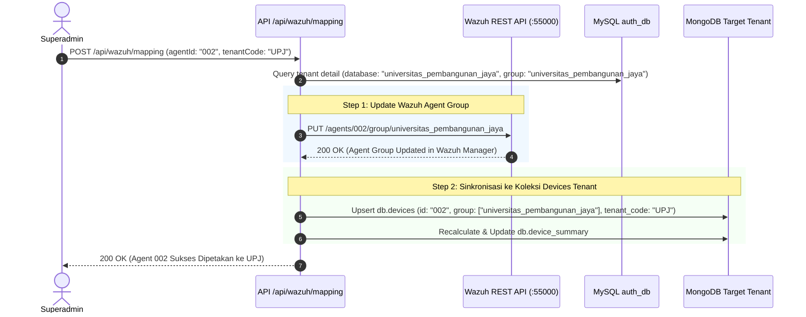

# Perencanaan Teknis Mendalam: FASE 4 — Pemetaan Agen Wazuh & Monitoring Background Service

Dokumen ini berisi spesifikasi teknis lengkap, alur logika integrasi, dan rancangan implementasi untuk **Fase 4: Pemetaan Agen Wazuh & Monitoring Background Service** pada portal Web Admin ASOC.

---

## 1. Ikhtisar & Tujuan Fase 4

Pada server backend ASOC (`10.175.209.82`), telemetri keamanan dan log insiden berasal dari agen **Wazuh** yang terpasang pada endpoint/server kampus. Agar alert yang masuk melalui **Fluent-Bit** dan **ASOC Agent Fetcher** terdistribusi secara akurat ke database masing-masing kampus (`universitas_indonesia`, `universitas_pembangunan_jaya`, `institut_teknologi_bandung`), sistem membutuhkan pemetaan (*mapping*) yang presisi antara Agen/Grup Wazuh dengan Tenant Kampus.

Selain itu, sistem ASOC mengandalkan serangkaian **background daemon microservices** (`fluent-bit`, `go_grpc_pumper` port 50057, `iris_case_shipper`, `asoc_agent_fetcher.timer`, `mongod`, `redis-server`, `mysqld`). Superadmin memerlukan panel pemantauan terpusat untuk memastikan seluruh pipeline background berjalan normal (*healthy*) dan tidak ada pipeline yang macet (*hung / failed*).

### Sasaran Utama Fase 4:
1. **Modul Pemetaan Agen Wazuh (`/agent-mapping`)**:
   * Menampilkan inventaris seluruh agen live dari Wazuh REST API (`:55000`).
   * Mengatur pemetaan `Agent ID` dan `Wazuh Group` ke database kampus target.
   * Mendeteksi agen aktif yang belum dipetakan (*Unassigned Agents*).
   * Menyediakan generator skrip pendaftaran agen (*One-Click Agent Enrollment Script Generator*).
2. **Modul Monitoring Background Service (`/service-monitor`)**:
   * Memeriksa status hidup/matinya servis latar belakang secara real-time.
   * Menampilkan riwayat dan ringkasan eksekusi batching terakhir dari masing-masing daemon (durasi, jumlah record tersinkron, pesan status).

---

## 2. Struktur Modul, Halaman & Komponen yang Dibangun

```
admin-dashboard-panel-1/
├── app/(admin)/
│   ├── agent-mapping/page.tsx              # Halaman 1: Pemetaan Agen Wazuh ke Tenant
│   └── service-monitor/page.tsx            # Halaman 2: Monitoring Background Daemons & Services
├── app/api/
│   ├── wazuh/
│   │   ├── agents/route.ts                 # API: Fetch live agents dari Wazuh API (:55000)
│   │   ├── mapping/route.ts                # API: POST/PUT pemetaan grup agen ke tenant
│   │   └── enrollment-script/route.ts      # API: Generate one-liner install command per kampus
│   └── services/
│       └── status/route.ts                 # API: Audit status systemd/daemon & log eksekusi
└── components/
    ├── agents/
    │   ├── AgentMappingTable.tsx           # Tabel agen, status live, OS, & dropdown mapping
    │   ├── UnassignedAgentAlert.tsx        # Banner peringatan agen yang belum dipetakan
    │   └── EnrollmentScriptModal.tsx       # Modal generator skrip instalasi agen per kampus
    └── services/
        ├── ServiceStatusGrid.tsx           # Grid kartu status live 7 background service
        ├── DaemonExecutionCard.tsx         # Rincian log eksekusi sinkronisasi terakhir
        └── DaemonLogsDrawer.tsx            # Slide-over drawer untuk inspeksi log servis
```

---

## 3. Spesifikasi Fungsional 2 Modul Utama

```
                                  ┌─────────────────────────────────────────────────────────┐
                                  │            WEB ADMIN: FASE 4 AGENTS & SERVICES          │
                                  └────────────────────────────┬────────────────────────────┘
                                                               │
                                ┌──────────────────────────────┴──────────────────────────────┐
                                │                                                             │
                                ▼                                                             ▼
                ┌───────────────────────────────┐                             ┌───────────────────────────────┐
                │   1. PEMETAAN AGEN WAZUH      │                             │ 2. MONITORING SERVICE DAEMON  │
                │       (/agent-mapping)        │                             │      (/service-monitor)       │
                ├───────────────────────────────┤                             ├───────────────────────────────┤
                │ • Live Agent Inventory :55000 │                             │ • 7 Background Services Audit │
                │ • Status: Active/Disconnected │                             │ • Fluent-Bit Alert Ingestion  │
                │ • Multi-Group Assignment      │                             │ • Go gRPC Pumper (Port 50057) │
                │ • Unassigned Agent Detection  │                             │ • DFIR-IRIS Case Shipper      │
                │ • One-Click Script Generator  │                             │ • ASOC Hourly Agent Fetcher   │
                │ • Auto Sync to Mongo Devices  │                             │ • Last Execution Metrics Log  │
                └───────────────────────────────┘                             └───────────────────────────────┘
```

---

### 📌 Modul 4.1: Pemetaan Agen Wazuh (*Wazuh Agent-to-Tenant Mapping* — `/agent-mapping`)

Mengintegrasikan portal admin dengan **Wazuh REST API v4.14.x** (`https://10.175.209.82:55000`) untuk inventarisasi dan pengaturan kepemilikan agen.



#### A. Fitur Utama Pemetaan Agen:
1. **Live Wazuh Agent Inventory**:
   * Memanggil endpoint `/agents?limit=500` ke Wazuh REST API.
   * Menampilkan: `Agent ID`, `Hostname / Agent Name`, `IP Address`, `OS Info` (e.g. *Ubuntu 24.04*, *Windows 11*), `Version` (*Wazuh v4.14.6*), `Status` (*Active*, *Disconnected*, *Never Connected*), `Wazuh Groups`, dan `Last Keepalive`.
2. **Pemetaan Grup & Database Tenant Interaktif**:
   * Dropdown pemilihan kampus target untuk setiap baris agen.
   * Saat disimpan, backend otomatis:
     1. Menetapkan grup di Wazuh Manager via API endpoint `/agents/{id}/group/{group_id}`.
     2. Melakukan upsert dokumen di koleksi `devices` pada database MongoDB kampus terkait.
     3. Memperbarui dokumen `device_summary` per-kampus.
3. **Deteksi Agen Belum Terpetakan (*Unassigned Agents Alert*)**:
   * Mengidentifikasi agen yang hanya memiliki grup `default` atau belum terdaftar di tabel `tenants` manapun.
   * Menampilkan banner peringatan di bagian atas halaman dengan tombol *Quick Assign*.
4. **Generator Skrip Pendaftaran Agen (*Agent Enrollment Helper*)**:
   * Modal dialog yang menghasilkan perintah instalasi satu baris (*one-liner command*) untuk Linux (Ubuntu/Debian, RHEL/CentOS) dan Windows (PowerShell):
   * Otomatis menginjeksi parameter IP Wazuh Manager (`10.175.209.82`) dan grup kampus target (misal: `WAZUH_AGENT_GROUP='universitas_indonesia'`).

---

### 📌 Modul 4.2: Monitoring Background Service & Daemon Health (`/service-monitor`)

Memantau kondisi kesehatan dan alur pemrosesan dari **7 background services / daemons** yang menjaga pipeline ASOC tetap beroperasi.

#### A. Daftar Servis yang Dimonitor:
| Nama Servis | Tipe / Protokol | Port / Socket | Peran & Alur Data |
| :--- | :--- | :--- | :--- |
| **`fluent-bit`** | Daemon Service | Unix Socket / Pipeline | Stream log & alert Wazuh realtime ➔ MongoDB per-tenant via Go Plugin. |
| **`go_grpc_pumper`** | Microservice (Go) | Port `50057` (HTTP/2 gRPC) | Stream delta dari MongoDB ➔ Redis L1 Cache (Batch: Inc 100, Vuln 500). |
| **`iris_case_shipper`** | Daemon Poller (Go) | REST API `:8443` | Polling kasus DFIR-IRIS (08:00–18:00 WIB) ➔ MongoDB `reports`. |
| **`asoc-agent-fetcher`** | Systemd Timer (1 Jam) | REST API `:55000` | Fetch hardware/OS/syscollector Wazuh ➔ MongoDB `devices` & Redis. |
| **`mongod`** | Database Engine | Port `27017` | Master SSOT document store (Database-per-Tenant). |
| **`redis-server`** | In-Memory Engine | Port `6379` | L1 In-Memory Fast Cache (TTL 7 Hari). |
| **`mysqld`** | RDBMS Engine | Port `3306` | Authentication & Multi-Tenant Registry (`auth_db`). |

#### B. Metrik & Telemetri yang Ditampilkan:
1. **Live Health Matrix Grid**:
   * Status: `ACTIVE (RUNNING)` (Hijau), `WAITING / IDLE` (Biru), `INACTIVE / STOPPED` (Abu-abu), `FAILED / ERROR` (Merah).
   * Detail Proses: Uptime, Memory RSS, CPU usage, dan PID proses.
2. **Log Eksekusi Pipeline Terakhir (*Execution Batch Telemetry*)**:
   * **Go gRPC Pumper**: Jumlah insiden, kerentanan, perangkat, dan laporan yang dipompa ke Redis pada siklus terakhir beserta durasi transfer ($ms$).
   * **IRIS Shipper**: Total kasus tersinkron, durasi ($ms$), dan timestamp eksekusi terakhir.
   * **ASOC Agent Fetcher**: Waktu trigger timer berikutnya (*Next Run Countdown*).

---

## 4. Spesifikasi Kontrak REST API Endpoint

### A. Endpoint: `GET /api/wazuh/agents`
* **Deskripsi**: Mengambil seluruh agen dari Wazuh REST API `:55000` dan mencocokkan status pemetaannya dengan database tenant di MySQL/Mongo.
* **Response Payload Format**:
```json
{
  "success": true,
  "timestamp": "2026-09-02T11:00:00.000Z",
  "summary": {
    "total": 2,
    "active": 2,
    "disconnected": 0,
    "unassigned": 0
  },
  "agents": [
    {
      "id": "001",
      "name": "tguard",
      "ip": "127.0.0.1",
      "status": "active",
      "version": "Wazuh v4.14.6",
      "os": { "name": "Ubuntu", "platform": "ubuntu", "version": "24.04.4 LTS" },
      "groups": ["universitas_indonesia"],
      "lastKeepAlive": "2026-09-02 10:58:30",
      "assignedTenant": {
        "tenantCode": "UI",
        "campusName": "Universitas Indonesia",
        "databaseName": "universitas_indonesia"
      },
      "isMapped": true
    },
    {
      "id": "002",
      "name": "FD-1664",
      "ip": "10.175.209.244",
      "status": "active",
      "version": "Wazuh v4.14.6",
      "os": { "name": "Windows", "platform": "windows", "version": "11 Enterprise" },
      "groups": ["universitas_pembangunan_jaya"],
      "lastKeepAlive": "2026-09-02 10:59:12",
      "assignedTenant": {
        "tenantCode": "UPJ",
        "campusName": "Universitas Pembangunan Jaya",
        "databaseName": "universitas_pembangunan_jaya"
      },
      "isMapped": true
    }
  ]
}
```

### B. Endpoint: `POST /api/wazuh/mapping`
* **Deskripsi**: Mengupdate pemetaan agen ke grup kampus dan mensinkronisasikan ke MongoDB `devices`.
* **Request Payload**:
```json
{
  "agentId": "002",
  "agentName": "FD-1664",
  "tenantCode": "UPJ"
}
```
* **Response Payload**:
```json
{
  "success": true,
  "message": "Agen 002 (FD-1664) berhasil dipetakan ke Universitas Pembangunan Jaya (UPJ).",
  "wazuhGroupUpdated": true,
  "mongoDevicesUpdated": true
}
```

### C. Endpoint: `GET /api/wazuh/enrollment-script`
* **Deskripsi**: Menghasilkan perintah instalasi agen Wazuh siap pakai.
* **Query Params**: `?tenantCode=UI&os=linux` atau `?tenantCode=UI&os=windows`
* **Response Payload**:
```json
{
  "success": true,
  "tenantCode": "UI",
  "campusName": "Universitas Indonesia",
  "targetGroup": "universitas_indonesia",
  "os": "linux",
  "command": "wget https://packages.wazuh.com/4.x/wazuh-agent_4.14.6-1_amd64.deb && sudo WAZUH_MANAGER='10.175.209.82' WAZUH_AGENT_GROUP='universitas_indonesia' dpkg -i ./wazuh-agent_4.14.6-1_amd64.deb && sudo systemctl daemon-reload && sudo systemctl enable wazuh-agent && sudo systemctl start wazuh-agent"
}
```

### D. Endpoint: `GET /api/services/status`
* **Deskripsi**: Memeriksa status hidup/matinya 7 daemon background dan metrik eksekusi terakhir.
* **Response Payload Format**:
```json
{
  "success": true,
  "timestamp": "2026-09-02T11:00:00.000Z",
  "systemHealth": "HEALTHY",
  "services": [
    {
      "id": "fluent_bit",
      "name": "Fluent-Bit Multi-Tenant Ingestion Plugin",
      "type": "daemon",
      "status": "RUNNING",
      "description": "Streaming alert Wazuh realtime ke MongoDB per-tenant",
      "uptime": "2h 45m",
      "lastEvent": "Active log processing"
    },
    {
      "id": "go_grpc_pumper",
      "name": "Go gRPC Multi-Tenant Pumper (Port 50057)",
      "type": "microservice",
      "status": "RUNNING",
      "port": 50057,
      "protocol": "HTTP/2 gRPC Protobuf v3",
      "lastRunMetrics": {
        "incidentsPumped": 100,
        "vulnsPumped": 500,
        "devicesPumped": 2,
        "reportsPumped": 9,
        "durationMs": 48.5,
        "timestamp": "2026-09-02 10:55:00 WIB"
      }
    },
    {
      "id": "iris_case_shipper",
      "name": "DFIR-IRIS Case Shipper Daemon",
      "type": "daemon",
      "status": "RUNNING",
      "pollingInterval": "10m",
      "operatingHours": "08:00 - 18:00 WIB",
      "lastRunMetrics": {
        "casesShipped": 9,
        "durationMs": 194.9,
        "statusText": "SUKSES 100%",
        "timestamp": "2026-09-02 10:50:00 WIB"
      }
    },
    {
      "id": "asoc_agent_fetcher",
      "name": "ASOC Hourly Wazuh Agent Fetcher Timer",
      "type": "timer",
      "status": "WAITING",
      "interval": "1 Hour",
      "nextRunCountdown": "25 Menit Lagi",
      "lastRunStatus": "SUCCESS"
    },
    {
      "id": "mongod",
      "name": "MongoDB Master Database",
      "type": "database",
      "status": "RUNNING",
      "port": 27017
    },
    {
      "id": "redis",
      "name": "Redis Real-Time Cache Server",
      "type": "database",
      "status": "RUNNING",
      "port": 6379
    },
    {
      "id": "mysql",
      "name": "MySQL Multi-Tenant & Auth Server",
      "type": "database",
      "status": "RUNNING",
      "port": 3306
    }
  ]
}
```

---

## 5. Rencana Langkah Kerja / Action Checklist Fase 4

- [ ] **Langkah 1**: Membuat API Backend `/api/wazuh/agents/route.ts` (Fetch agen live dari Wazuh API `:55000` + join metadata tenant MySQL).
- [ ] **Langkah 2**: Membuat API Backend `/api/wazuh/mapping/route.ts` (Update grup di Wazuh Manager via REST API + upsert koleksi MongoDB `devices`).
- [ ] **Langkah 3**: Membuat API Backend `/api/wazuh/enrollment-script/route.ts` (Generator perintah instalasi satu baris Linux/Windows).
- [ ] **Langkah 4**: Membuat komponen UI `components/agents/AgentMappingTable.tsx`, `UnassignedAgentAlert.tsx`, `EnrollmentScriptModal.tsx`, dan halaman `/agent-mapping/page.tsx`.
- [ ] **Langkah 5**: Membuat API Backend `/api/services/status/route.ts` (Audit status kesehatan 7 daemon service & parsing metrik eksekusi batching).
- [ ] **Langkah 6**: Membuat komponen UI `components/services/ServiceStatusGrid.tsx`, `DaemonExecutionCard.tsx`, dan halaman `/service-monitor/page.tsx`.
- [ ] **Langkah 7**: Build verifikasi `npm run build` dan validasi pengujian integrasi live ke Wazuh API dan background daemons pada server ASOC `10.175.209.82`.

---

## 6. Kriteria Uji Terima & Verifikasi Keberhasilan (*Acceptance Criteria*)

| No | Pengujian | Indikator Keberhasilan |
| :--- | :--- | :--- |
| 1 | **Live Agent Discovery** | Halaman `/agent-mapping` menampilkan seluruh agen yang terdaftar di Wazuh Manager `:55000` secara akurat lengkap dengan status online/offline. |
| 2 | **Agent Group Mapping** | Pengubahan pemetaan kampus untuk suatu agen berhasil memperbarui grup di Wazuh Manager dan dokumen di MongoDB `devices` kampus target. |
| 3 | **Unassigned Agent Alert** | Agen baru tanpa grup kampus terdeteksi dan memunculkan banner peringatan otomatis di portal admin. |
| 4 | **Enrollment Script Helper** | Perintah instalasi agen yang dihasilkan modal dapat langsung dijalankan pada mesin klien dan otomatis terdaftar ke grup kampus yang benar. |
| 5 | **Service Health Monitoring** | Status seluruh background services (`fluent-bit`, `go_grpc_pumper` port 50057, `iris_case_shipper`, `asoc_agent_fetcher.timer`, `mongod`, `redis`, `mysql`) terdeteksi hijau/merah secara real-time disertai log ringkasan eksekusi terakhir. |
