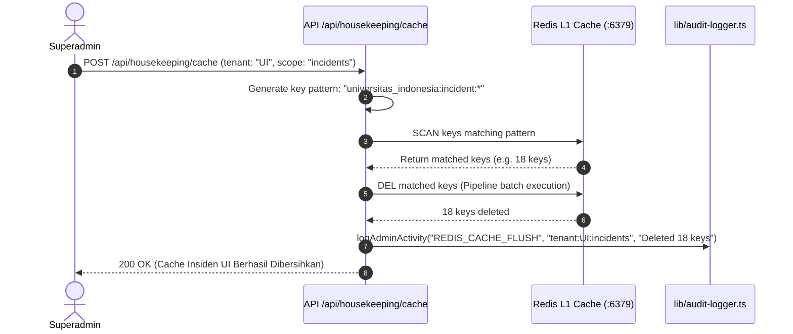

# Perencanaan Teknis Mendalam: FASE 5 — Housekeeping, Cache Control & Admin Audit Trail

Dokumen ini berisi spesifikasi teknis lengkap, alur logika pemeliharaan data, dan rancangan implementasi untuk **Fase 5: Housekeeping, Cache Control & Admin Audit Trail** pada portal Web Admin ASOC.

---

## 1. Ikhtisar & Tujuan Fase 5

Dalam operasional ASOC yang berjalan 24/7, ribuan log alert insiden, kerentanan, dan telemetri perangkat terus mengalir ke server `10.175.209.82`. Tanpa manajemen pemeliharaan data (*housekeeping*), kapasitas disk MongoDB dan memori Redis dapat terus membengkak.

Selain itu, untuk menjamin akuntabilitas tata kelola sistem (*system governance & compliance*), seluruh tindakan administratif berisiko tinggi yang dilakukan Superadmin (seperti pembuatan/penghapusan akun, pemicuan sinkronisasi data, pembersihan cache, atau pemusnahan data lama) wajib dicatat secara otomatis ke dalam **Admin Activity Audit Trail**.

### Sasaran Utama Fase 5:
1. **Modul Housekeeping & Cache Control (`/housekeeping`)**:
   * **Selective Redis Cache Flush**: Membersihkan cache in-memory Redis hanya pada prefix kampus tertentu (`<tenant_prefix>:*`) atau entitas tertentu (*incidents, vulns, devices, reports*) tanpa mengganggu kampus lain.
   * **MongoDB Historic Data Retention & Purge**: Membersihkan dokumen insiden/kerentanan lama yang telah melewati masa retensi (misal: $> 90$ atau $> 180$ hari) pada database tenant tertentu.
   * **Dry-Run Simulation**: Pratinjau jumlah record yang akan dihapus dan estimasi penghematan ruang disk sebelum eksekusi pembersihan nyata.
2. **Modul Log Riwayat Aktivitas Admin (`/audit-logs`)**:
   * **Automated Audit Logger Helper (`lib/audit-logger.ts`)**: Merekam metadata setiap aksi admin (*timestamp*, *IP address*, *admin username*, *action type*, *target resource*, *status*, dan *JSON payload detail*).
   * **Interactive Audit Log Viewer**: Antarmuka visual untuk meninjau riwayat aksi administratif dengan fitur pencarian, filter tanggal, filter jenis aksi, pagination, dan export log.

---

## 2. Struktur Modul, Halaman & Komponen yang Dibangun

```
admin-dashboard-panel-1/
├── app/(admin)/
│   ├── housekeeping/page.tsx               # Halaman 1: Pembersihan Cache & Retensi Data
│   └── audit-logs/page.tsx                 # Halaman 2: Log Riwayat Aktivitas Admin
├── app/api/
│   ├── housekeeping/
│   │   ├── cache/route.ts                  # API: Selective Flush Redis Cache per-tenant
│   │   └── cleanup/route.ts                # API: Dry-Run & Purge dokumen lama MongoDB
│   └── audit-logs/
│       └── route.ts                        # API: Query & Export riwayat audit logs
├── lib/
│   └── audit-logger.ts                     # Helper otomatis pencatatan audit log
└── components/
    ├── housekeeping/
    │   ├── StorageBreakdownCard.tsx        # Visualisasi ukuran database & koleksi Mongo
    │   ├── FlushCacheModal.tsx             # Modal dialog konfirmasi selective flush Redis
    │   └── CleanupDataModal.tsx            # Modal dry-run & eksekusi purge data lama
    └── audit/
        ├── AuditLogTable.tsx               # Tabel log viewer dengan status badge & waktu
        ├── AuditFilterBar.tsx              # Filter rentang tanggal, action type, & search
        └── AuditDetailModal.tsx            # Modal inspeksi payload detail JSON aksi admin
```

---

## 3. Spesifikasi Fungsional 2 Modul Utama

```
                                  ┌─────────────────────────────────────────────────────────┐
                                  │           WEB ADMIN: FASE 5 HOUSEKEEPING & AUDIT        │
                                  └────────────────────────────┬────────────────────────────┘
                                                               │
                                ┌──────────────────────────────┴──────────────────────────────┐
                                │                                                             │
                                ▼                                                             ▼
                ┌───────────────────────────────┐                             ┌───────────────────────────────┐
                │ 1. HOUSEKEEPING & CACHE       │                             │  2. ADMIN ACTIVITY AUDIT      │
                │        (/housekeeping)        │                             │         (/audit-logs)         │
                ├───────────────────────────────┤                             ├───────────────────────────────┤
                │ • Selective Redis Flush       │                             │ • Automated Activity Logging  │
                │   (Scoped by Tenant Prefix)   │                             │ • IP Address & Timestamp (WIB)│
                │ • Sub-Entity Flush (Inc/Vuln) │                             │ • Action Types Classification │
                │ • MongoDB Historic Data Purge │                             │ • Target Resource Tracking    │
                │ • Dry-Run Deletion Simulation │                             │ • Search, Date Filter & Export│
                │ • Storage Breakdown per DB    │                             │ • JSON Payload Inspector Modal│
                └───────────────────────────────┘                             └───────────────────────────────┘
```

---

### 📌 Modul 5.1: Housekeeping & Cache Control (`/housekeeping`)

Modul ini mengelola kebersihan data (*data hygiene*) pada **Redis L1 Cache** dan **MongoDB Master SSOT**.



#### A. Fitur Pembersihan Cache Redis (*Selective Redis Flush*):
* **Pencegahan Global Flush**: Fitur berbahaya seperti `FLUSHALL` / `FLUSHDB` dinonaktifkan untuk mencegah terhapusnya data seluruh kampus secara tidak sengaja.
* **Pilihan Scope Pembersihan**:
  1. **All Keys for Tenant**: Menghapus seluruh keys dengan prefix `<tenant_prefix>:*` (misal: `universitas_indonesia:*`).
  2. **Incidents Only**: Menghapus hanya `<tenant_prefix>:incident:*` dan `<tenant_prefix>:incidents`.
  3. **Vulnerabilities Only**: Menghapus hanya `<tenant_prefix>:vulnerability:*` dan `<tenant_prefix>:vulnerabilities`.
  4. **Devices Only**: Menghapus hanya `<tenant_prefix>:device:*` dan `<tenant_prefix>:devices:*`.
  5. **Reports Only**: Menghapus hanya `<tenant_prefix>:reports:*` dan `<tenant_prefix>:reports`.
* **Opsi Auto-Repump**: Setelah cache dibersihkan, admin dapat mencentang opsi *"Auto-Repump Fresh Data from MongoDB"* untuk langsung mengisi ulang cache dengan data terbaru.

#### B. Fitur Retensi Data MongoDB (*Historic Data Purge*):
* Mengizinkan admin menghapus dokumen log insiden atau kerentanan lama pada database MongoDB kampus tertentu berdasarkan ambang batas umur data:
  * Lebih lama dari **30 Hari**
  * Lebih lama dari **90 Hari**
  * Lebih lama dari **180 Hari**
  * Lebih lama dari **1 Tahun**
  * Rentang Tanggal Kustom (*Before Date: YYYY-MM-DD*)
* **Simulasi Dry-Run**: Sebelum penghapusan permanen dijalankan, admin dapat menekan tombol *Simulate Dry Run* untuk melihat:
  * Total dokumen yang cocok dengan kriteria penghapusan.
  * Estimasi ruang disk yang akan dibebaskan.
* **Safety Confirmation**: Memerlukan input ketik konfirmasi (misal: ketik nama kampus `UNIVERSITAS INDONESIA` atau `PURGE`) sebelum penghapusan data fisik dijalankan.

---

### 📌 Modul 5.2: Log Riwayat Aktivitas Admin (*Admin Activity Trail* — `/audit-logs`)

Modul ini bertanggung jawab mencatat dan menyajikan seluruh rekam jejak aktivitas Superadmin secara transparan.

#### A. Kategori Aksi yang Dicatat Otomatis (*Action Types*):
| Action Type | Deskripsi Tindakan |
| :--- | :--- |
| **`AUTH_LOGIN` / `LOGOUT`** | Login atau logout sesi Superadmin ke Web Admin portal. |
| **`USER_CREATE`** | Pembuatan akun pengguna baru (beserta role dan penugasan kampus). |
| **`USER_UPDATE`** | Pengubahan email, role, atau profil pengguna. |
| **`USER_DELETE`** | Penghapusan akun pengguna dan pencabutan sesi aktif. |
| **`USER_RESET_PASSWORD`** | Tindakan reset password akun pengguna. |
| **`TENANT_CREATE`** | Pendaftaran kampus baru dan provisioning database MongoDB baru. |
| **`TENANT_UPDATE`** | Pembaruan profil PIC kampus atau nama instansi. |
| **`TENANT_STATUS_TOGGLE`** | Pengubahan status kampus (*ACTIVE* vs *SUSPENDED*). |
| **`AGENT_MAPPING_UPDATE`** | Pengubahan pemetaan grup agen Wazuh ke database kampus. |
| **`MANUAL_SYNC_TRIGGER`** | Eksekusi manual sinkronisasi data pipeline antar-layer. |
| **`REDIS_CACHE_FLUSH`** | Pembersihan cache Redis selektif per-tenant. |
| **`MONGO_DATA_CLEANUP`** | Pembersihan dokumen lama di database MongoDB. |

#### B. Struktur Skema Database `admin_audit_logs`:
Disimpan pada tabel MySQL `auth_db.admin_audit_logs` (atau koleksi MongoDB `platform_master.admin_audit_logs`):
```sql
CREATE TABLE IF NOT EXISTS admin_audit_logs (
  id INT AUTO_INCREMENT PRIMARY KEY,
  timestamp TIMESTAMP DEFAULT CURRENT_TIMESTAMP,
  admin_id INT NOT NULL,
  admin_username VARCHAR(100) NOT NULL,
  ip_address VARCHAR(45) NOT NULL,
  user_agent TEXT,
  action_type VARCHAR(50) NOT NULL,
  target_resource VARCHAR(150),
  status ENUM('SUCCESS', 'FAILED') DEFAULT 'SUCCESS',
  details JSON,
  INDEX idx_action (action_type),
  INDEX idx_timestamp (timestamp)
);
```

#### C. Antarmuka Log Viewer (`/audit-logs`):
* **Live Search & Filter Bar**:
  * Filter berdasarkan Rentang Tanggal (*Today, 7D, 30D, Custom*).
  * Filter berdasarkan Tipe Aksi (*Authentication, User Management, Tenant, Maintenance, Sync*).
  * Filter Status (*Success / Failed*).
  * Pencarian teks bebas (*Username, Target Resource, IP Address*).
* **Modal Detail JSON**: Klik pada baris log untuk membuka modal inspeksi lengkap yang menampilkan *raw JSON payload* dan detail sebelum/sesudah perubahan.
* **Fitur Export**: Tombol *Export to CSV* dan *Export to JSON* untuk dokumentasi laporan kepatuhan berkala.

---

## 4. Spesifikasi Kontrak REST API Endpoint

### A. Endpoint: `POST /api/housekeeping/cache`
* **Deskripsi**: Membersihkan kunci cache Redis selektif per-tenant dengan opsi auto-repump.
* **Request Payload Format**:
```json
{
  "tenantCode": "UI",
  "scope": "incidents",  // "all" | "incidents" | "vulnerabilities" | "devices" | "reports"
  "autoRepump": true
}
```
* **Response Payload Format (200 OK)**:
```json
{
  "success": true,
  "tenantCode": "UI",
  "databaseName": "universitas_indonesia",
  "scope": "incidents",
  "patternCleared": "universitas_indonesia:incident:*",
  "keysDeleted": 18,
  "autoRepumpExecuted": true,
  "repumpedCount": 70,
  "executionDurationMs": 85,
  "message": "Sukses membersihkan 18 kunci cache insiden untuk Universitas Indonesia dan memompa ulang 70 data segar."
}
```

### B. Endpoint: `POST /api/housekeeping/cleanup`
* **Deskripsi**: Melakukan simulasi dry-run atau eksekusi pemusnahan data historis lama di MongoDB.
* **Request Payload Format**:
```json
{
  "tenantCode": "UI",
  "collection": "incident", // "incident" | "vulnerability" | "all"
  "olderThanDays": 90,
  "dryRun": false,
  "confirmKeyword": "UNIVERSITAS INDONESIA"
}
```
* **Response Payload Format (200 OK)**:
```json
{
  "success": true,
  "isDryRun": false,
  "tenantCode": "UI",
  "databaseName": "universitas_indonesia",
  "collection": "incident",
  "cutoffDate": "2026-06-04T00:00:00.000Z",
  "deletedDocumentsCount": 142,
  "estimatedStorageFreedBytes": 245760,
  "executionDurationMs": 120,
  "message": "Pembersihan data historis berhasil. Total 142 dokumen insiden sebelum 2026-06-04 telah dimusnahkan."
}
```

### C. Endpoint: `GET /api/audit-logs`
* **Deskripsi**: Mengambil riwayat log audit aktivitas admin dengan filter dan pagination.
* **Query Params**: `?page=1&limit=25&action=all&search=&startDate=&endDate=`
* **Response Payload Format**:
```json
{
  "success": true,
  "pagination": {
    "currentPage": 1,
    "pageSize": 25,
    "totalRecords": 184,
    "totalPages": 8
  },
  "logs": [
    {
      "id": 184,
      "timestamp": "2026-09-02 11:10:25 WIB",
      "adminUsername": "superadmin",
      "ipAddress": "10.175.209.1",
      "actionType": "REDIS_CACHE_FLUSH",
      "targetResource": "redis:universitas_indonesia:incident:*",
      "status": "SUCCESS",
      "details": {
        "tenantCode": "UI",
        "scope": "incidents",
        "keysDeleted": 18,
        "autoRepump": true
      }
    },
    {
      "id": 183,
      "timestamp": "2026-09-02 10:45:12 WIB",
      "adminUsername": "superadmin",
      "ipAddress": "10.175.209.1",
      "actionType": "USER_CREATE",
      "targetResource": "user:analyst_ub_1",
      "status": "SUCCESS",
      "details": {
        "role": "tenant",
        "tenant": "Universitas Brawijaya"
      }
    }
  ]
}
```

---

## 5. Rencana Langkah Kerja / Action Checklist Fase 5

- [ ] **Langkah 1**: Membuat tabel `admin_audit_logs` di MySQL `auth_db` (atau koleksi di MongoDB).
- [ ] **Langkah 2**: Mengembangkan modul helper `lib/audit-logger.ts` untuk fungsi `logAdminActivity(...)`.
- [ ] **Langkah 3**: Mengintegrasikan pemanggilan `logAdminActivity` pada seluruh endpoint backend admin yang sudah ada (Auth, User CRUD, Tenant Provisioning, Sync, Mapping).
- [ ] **Langkah 4**: Membuat API Backend `/api/housekeeping/cache/route.ts` (Selective Redis cache flush & auto-repump).
- [ ] **Langkah 5**: Membuat API Backend `/api/housekeeping/cleanup/route.ts` (Dry-run simulation & MongoDB historic purge).
- [ ] **Langkah 6**: Membuat komponen UI `components/housekeeping/StorageBreakdownCard.tsx`, `FlushCacheModal.tsx`, `CleanupDataModal.tsx`, dan halaman `/housekeeping/page.tsx`.
- [ ] **Langkah 7**: Membuat API Backend `/api/audit-logs/route.ts` (Query audit logs, filter, search, & export CSV).
- [ ] **Langkah 8**: Membuat komponen UI `components/audit/AuditLogTable.tsx`, `AuditFilterBar.tsx`, `AuditDetailModal.tsx`, dan halaman `/audit-logs/page.tsx`.
- [ ] **Langkah 9**: Build verifikasi `npm run build` dan validasi pengujian pembersihan cache selektif serta pencatatan audit log secara nyata ke server ASOC `10.175.209.82`.

---

## 6. Kriteria Uji Terima & Verifikasi Keberhasilan (*Acceptance Criteria*)

| No | Pengujian | Indikator Keberhasilan |
| :--- | :--- | :--- |
| 1 | **Selective Redis Flush** | Pembersihan cache tenant UI berhasil menghapus kunci `universitas_indonesia:*` tanpa mempengaruhi cache kampus UPJ atau ITB di Redis. |
| 2 | **Auto-Repump Cache** | Jika opsi auto-repump dicentang saat flush, Redis langsung terisi kembali dengan data terbaru dari MongoDB. |
| 3 | **Dry-Run Data Purge** | Simulasi dry-run menampilkan hitungan dokumen yang akurat tanpa melakukan penghapusan data fisik sebelum konfirmasi final. |
| 4 | **Automated Audit Logging** | Setiap tindakan Superadmin (login, buat user, provisioning tenant, trigger sync, flush cache) otomatis tercatat di tabel `admin_audit_logs` lengkap dengan IP, waktu WIB, dan detail JSON. |
| 5 | **Audit Filter & Export** | Halaman `/audit-logs` dapat memfilter log berdasarkan tanggal/aksi dan mengekspor riwayat ke file CSV dengan format rapi. |
